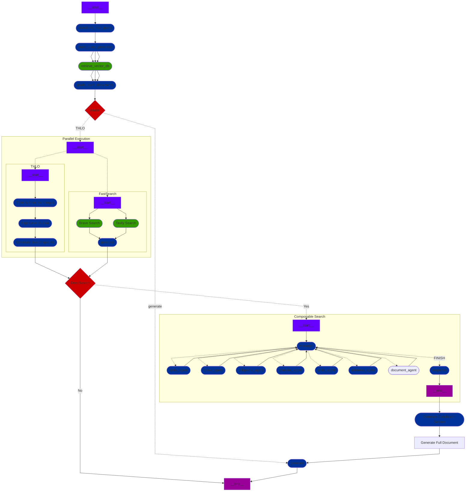
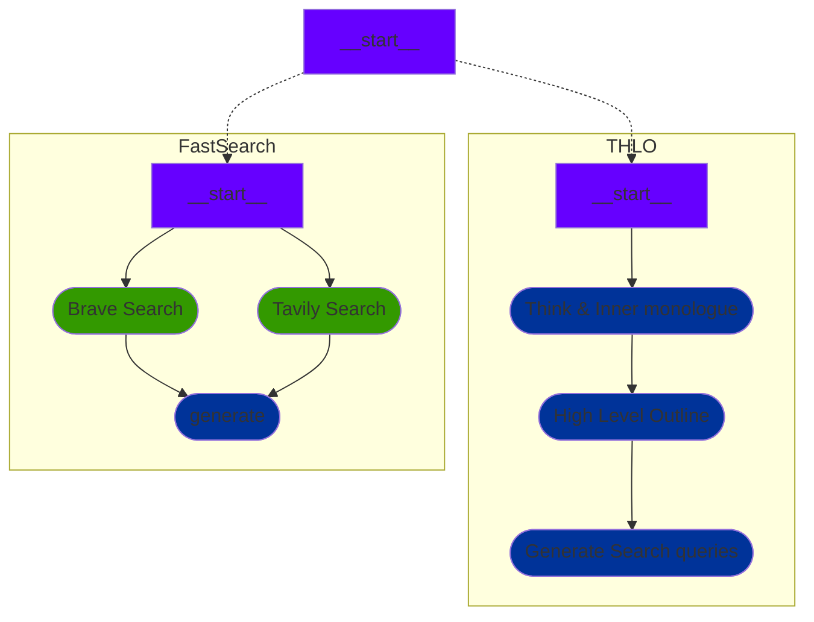
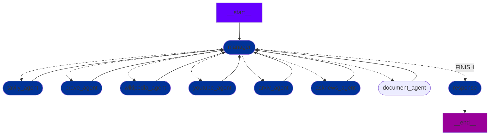
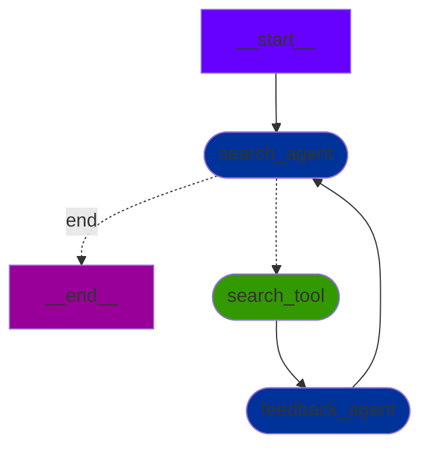

## 📌 ALL FlowChart 📌
The overall flow chart of PAR is as follows:

### 🛠 Parallel Execution
Looking in detail at the steps that are executed in parallel, following:

**THLO** and **Fast Search** are executed **simultaneously** in **parallel**.

### 🦾 Multi Agent
Looking at the steps where multiple agents collaborate with each other, have the following:

- The agent corresponding to the `manager`, based on the plan for each section generated in the **THLO** step, creates instructions for writing the content of that section and delivers them to the agents specialized in each search engine.
- Finally, when the search is completed, the `document_agent` is called to write the content for the section.

### ⚙ Each Search Agent
The agents specialized in each search engine go through the following detailed steps:

- When the search agent receives **instructions** through the `manager agent`, it starts the search through the tool based on the instructions.
- The searched content is organized on the client-side in the `search_tool` step and then passed to the `feedback_agent`.
- The `feedback_agent` evaluates the searched content and then passes it back to the search agent.
- The search agent decides whether to proceed with a new search query based on the feedback content or to terminate the search.