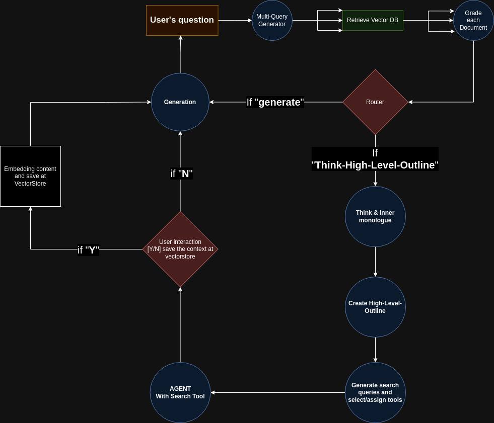

# Powerful-Auto-Researcher(PAR)

## 👋 Introduction 👋  
Hello! I am a beginner developer who is greatly interested in the rapidly emerging field of LLMs.

This is an experimental project in its early stages, created for the purpose of studying LLM prompting and Python for my own study.  
However, I believe it to be quite an intriguing idea, and I wish to receive ample feedback and opinions from the brilliant developers on GitHub, while honing my development skills!!  

Thank you for coming by, and please keep an eye out for future updates!

## 🌠 OverView 🌠
This project aims to build a more powerful RAG system powered by [LangChain](https://github.com/langchain-ai/langchain), [LangGraph](https://github.com/langchain-ai/langgraph), and [Anthropic](https://www.anthropic.com/).  
While the project is still in its early experimental stages and there are many steps that I ahead, it is an endeavor that I would like to share with the brilliant developers on GitHub, discussing exciting ideas and possibilities!

### ❗WARNING❗
#### **This project may use so many tokens, so be careful!**
### ❗WARNING❗

## 🧐 What is RAG(Retrieval-Augmented Generation)?
Retrieval-Augmented Generation(RAG) is a process that optimizes the output of large language models(LLMs) by enabling them to reference reliable knowledge bases outside of their training data sources before generating responses.  
LLMs are trained on vast amounts of data and use billions of parameters to generate original results for tasks such as answering questions, translating languages, and completing sentences.  
RAG extends the capabilities of already powerful LLMs to the internal knowledge bases of specific domains or organizations, eliminating the need to retrain the model. This is a cost-effective approach to improving LLM results and maintaining relevance, accuracy, and usefulness across a variety of scenarios.


## 👀 So, What is the main difference between RAG and your project PAR(Powerful-Auto-Researcher)?
### Concept & Features 💪
This PAR Project draws inspiration from various approaches, including:
* [LangChain's Multi-Query-Retriever](https://python.langchain.com/docs/modules/data_connection/retrievers/MultiQueryRetriever)
* [LangGraph - Corrective RAG(CRAG)](https://github.com/langchain-ai/langgraph/blob/main/examples/rag/langgraph_crag.ipynb)
* [LangGraph - STORM](https://github.com/langchain-ai/langgraph/blob/main/examples/storm/storm.ipynb)
* [Other diverse prompting techniques](https://arxiv.org/abs/2312.16171)


This PAR project primarily use Anthropic's Claude 3 family due to their **Long Context Window** capability.  
Although the advent of '**Long Context Window**' has reduced the necessity for **RAG**, this PAR project aims to leverage its advantages beyond the scope of a single document.  
Unlike conventional RAG techniques that extract small token amounts from various sources, PAR seeks to retrieve more substantial token content from diverse origins.  
By processing a large volume of tokens and sources on a single topic simultaneously, the project strives to achieve higher-quality results.

To this end, PAR project employs a prompting approach similar to **Multi-Query-Retriever**, where the user's original question is interpreted from multiple perspectives and reformulated into different question formats on the same topic.  
This enables the model to handle a wider range of thought processes and adaptability, which is the primary objective.


The second powerful aspect of PAR lies in its ability to generate documents autonomously by leveraging custom search engines developed by the project's creators.  
This allows for extensive searches and the utilization of diverse sources such as Google, arXiv, YouTube, Wikipedia, and more.

User often invest significant time in conducting searches. To address this issue, PAR aims to integrate results from various search engines to automatically generate documents.  
These documents are made available for users to access later and are embedded and stored in a vector store for future use in identical or similar content searches.


## 💻 How does Powerful-Auto-Researcher (PAR) work? 💻
PAR is fundamentally designed to start with the user's question, convert it into multi-queries, and leverage the existing vector DB data sources possessed by the user or developer.


### 👾 **Multi-Query-Generate**  
To search the vector DB, the user's question is transformed into three different queries serving the following purposes:
1. Regenerate a related search query focusing on the core aspects of the original question.
2. Regenerate a query using semantically similar phrases to the original question.
3. Regenerate a new query expanding on the potential intent behind the original question.
   - These queries are generate through an LLM. You can check the details of the prompt in this [LangSmith]() page :)


### 🔍 **Vector DB Search**  
For each of the three generated queries, a search is conducted in the user's current vector DB, and the search results are retrieved. In the current project, the PineCone Online Vector Database is used, and a maximum of three search results are obtained for each query.


### 💯 **Grade**  
The LLM evaluates the vector DB search results for each of the three queries. After the evaluation, similar to a typical RAG system, the results are used to either generate a response(**Generation**) or move to the **Thought-High-Level-Outline** stage.  
(This part is currently under consideration and design to explore more possibilities.)


### 📚 **Thought-High-Level-Outline**  
(This **Thought-High-Level-Outline** part is also under consideration and design to explore more possibilities and exciting experiments.)  
I think this is considered the most powerful part of this project.  
It combines three different smaller components implemented as a LangGraph:
  - 📗 **Think & Inner monologue**: The LLM "thinks" about why the user asked the question and what content the LLM itself would like to see included in the final document if it were the user.  
    - You can check the details of the prompt in this [LangSmith]() page :)
  - 📘 **Create a draft & outline**: Based on the thoughts from the previous step, a high-level draft of the document is generated. This step focuses on creating a high-level outline rather than a completed draft. (This is quite similar to the Plan stage in the Plan-and-Execute architecture.)
  - 📋 **Generate search queries and select/assign tools**: For performing actual "searches" based on the thoughts and sections generated in the previous steps.  
    These three steps are inspired by the STORM architecture in LangGraph.


### 🦾 **Agent**  
This part is identical to the standard Agent provided by LangChain.  
However, since an Anthropic version is being used, several "code" modifications have been made by directly examining and customizing LangChain modules.  
Currently, four search engines are being used:  
*Tavily*, *Wikipedia*, *YouTube*, and *arXiv*. If you have the opportunity to directly inspect the code or have a keen interest, your active feedback is highly appreciated!  
Please note that the code may change based on updates to LangChain.


### ✉️ **Generation**  
(This stage is also currently under consideration and design to explore more possibilities.)  
Similar to the G(Generation) step in a typical RAG, this stage generates the final response.  
If coming from the ***Grade*** stage, the response is generated based on the contents searched from the Vector DB.  
If coming from the ***Thought-High-Level-Outline*** stage, the response is generated based on the document created through the previous stages.

Before generating the response, the user can decide whether to review and store the generated document in the vector DB.


#### The next diagram is illustrates the conceptual flow of this project:  



## 🚀 HOW TO START 🚀
The main third-pary libraries currently used in this project are:
#### 1. [LangChain(Main Interface)](https://github.com/langchain-ai/langchain)
#### 2. [LangGraph(Recursive structure and Clear flow)](https://github.com/langchain-ai/langgraph)
#### 3. [LangSmith(Debugging)](https://docs.smith.langchain.com/)
#### 4. [Anthropic(Language Model)](https://docs.anthropic.com/claude/docs/models-overview#claude-3-a-new-generation-of-ai)
#### 5. [OpenAI(Embedding Model)](https://platform.openai.com/docs/models/embeddings)
#### 6. [Tavily API(Main Search Engine)](https://docs.tavily.com/docs/tavily-api/introduction)
#### 7. [PineCone(Vector Store)](https://www.pinecone.io/)
* Vector store provided by LangChain, freely usable with any [vector store supported by LangChain](https://python.langchain.com/docs/integrations/vectorstores). For testing, please use an any Online Vector Store!
#### 8. YouTube Search(Main Search Engine)
#### 9. Wikipedia(Main Search Engine)
#### 10. arXiv(Main Search Engine)


The main libraries required for running the project can be found in the **requirements.txt** file.

To clone the project, run the following command:
```text
git clone https://github.com/MIRACLE-cowf/Powerful-Auto-Researcher.git
cd Powerful-Auto-Researcher
```

Next, install the required libraries:
```python
pip install -r requirements.txt
```
SET API Keys in .evn at PAR folder!

To start the project, run:  
```Console
py -m main
```

## 🔍 Question 🔎
Why use Anthropic?

- It is my personal judgment, but I found Anthropic to be more finely tunable simply through prompts. Moreover, the **Long Context Window** was incredibly appealing for this project. However, this does not mean that other LLM models are incompatible. As all interfaces of the project operate based on LangChain, there is a high possibility of it functioning with all [LLMs](https://python.langchain.com/docs/integrations/llms/) and [Chat Models](https://python.langchain.com/docs/integrations/chat/) supported by LangChain. (I cannot give a definite answer as I have not tested it out! My apologies!)

Which Anthropic model should I use?

- In all cases, I used Anthropic's **haiku** model! However, when it came to handling the operation of the agent, models beyond haiku, such as **sonnet** and **opus**, provided significantly better performance. It seems that it does not matter which model you use! One thing for certain is that I believe the sonnet or opus models will exhibit much better performance. (I cannot give a definite answer for this part as well, as I have not conducted many tests yet! My apologies!)


## 🔥 FeedBack 🔥
As a beginner developer, I am greatly seeking diverse feedback from the brilliant developers on GitHub!

I would appreciate any kind of feedback, regardless of the type, be it Python syntax, structure, prompting, readme, etc.!


Thank you!  
miracle.cowf@gmail.com